# Architecture & Decision Logic

## Introduction

This is a **production arbitrage trading bot** that finds price differences for
the same token pair across decentralized exchanges (DEXes) and profits from them
using flash loans.

**Example:** WETH/USDC is trading at $2,300 on Uniswap and $2,306 on SushiSwap
(0.26% spread). The bot borrows WETH via an Aave flash loan, buys USDC on
Uniswap (cheaper), sells USDC on SushiSwap (more expensive), repays the loan +
fee, and keeps the difference — all in a single atomic transaction. If anything
fails, the entire transaction reverts and no money is lost (only gas on L2, or
nothing on Ethereum via Flashbots).

**Design philosophy:** Capital preservation > profit > speed. The system is
designed to reject 99%+ of detected opportunities. Missing a trade is always
better than losing money.

**Scale:** The bot monitors 7 chains, 10+ DEXes, and 15+ token pairs
simultaneously, evaluating hundreds of cross-DEX pairs per scan cycle
(every 2-8 seconds).

---

## High-Level Architecture

### System components

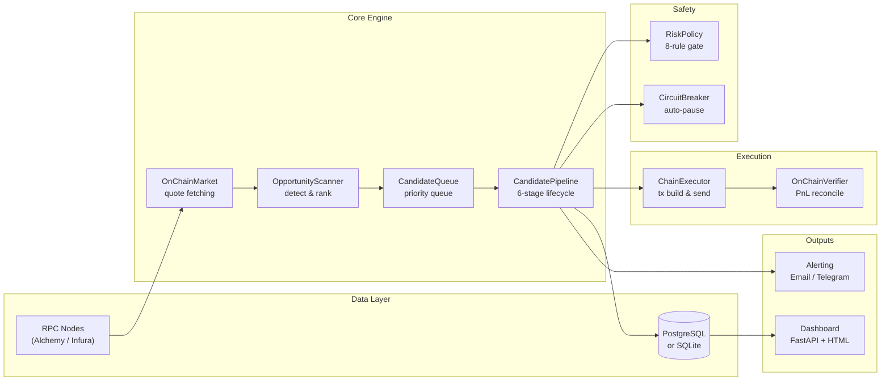

### Threading model

The system runs 5 threads. The main thread handles OS signals for graceful
shutdown. All worker threads are daemons — they terminate automatically when
the main thread exits.

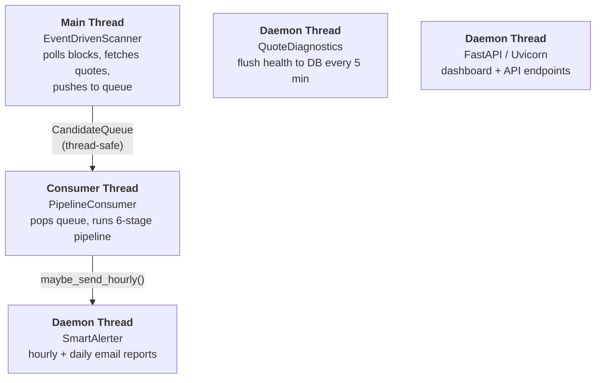

### Key source files

| File | Purpose |
|------|---------|
| `src/run_event_driven.py` | Main entry point, wires everything together |
| `src/onchain_market.py` | Fetches live quotes from DEXes via RPC |
| `src/scanner.py` | Detects and ranks arbitrage opportunities |
| `src/strategy.py` | Cost model and net profit calculation |
| `src/pipeline/lifecycle.py` | 6-stage candidate pipeline |
| `src/pipeline/queue.py` | Bounded priority queue |
| `src/risk/policy.py` | 8-rule risk evaluation |
| `src/risk/circuit_breaker.py` | Auto-pause on failures |
| `src/chain_executor.py` | Builds and sends on-chain transactions |
| `src/pipeline/verifier.py` | Verifies tx outcome, reconciles PnL |
| `src/models.py` | Core data models (Opportunity, MarketQuote) |
| `src/config.py` | Configuration loading and validation |
| `contracts/FlashArbExecutor.sol` | Solidity contract for atomic flash arb |

---

## End-to-End Workflow

This is the complete path an opportunity takes from detection to execution.
Every numbered step is a potential exit point — a failure at any step stops
the pipeline for that opportunity.

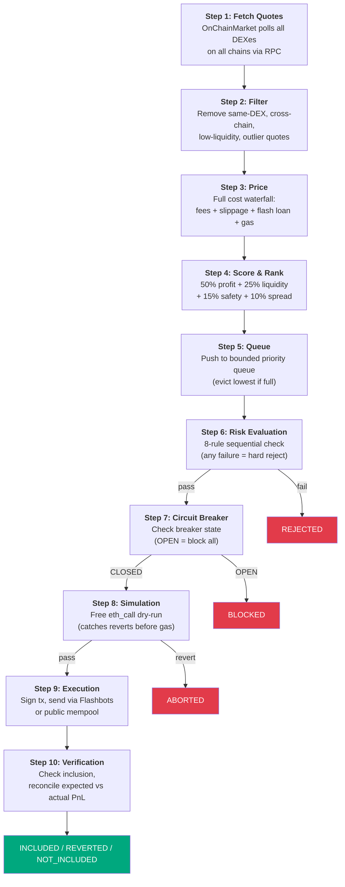

The rest of this document walks through **each step in detail**.

---

## Step 1: Fetch Quotes (`onchain_market.py`)

The `OnChainMarket` fetches live prices from every configured DEX on every
chain by calling on-chain quoter contracts via RPC.

### How it works

For each (pair, DEX, chain) combination:
1. Call the DEX's on-chain quoter (e.g., Uniswap V3 `quoteExactInputSingle`)
2. The quoter returns the exact output amount for a given input — this is a
   real on-chain calculation, not an off-chain estimate
3. Wrap the result in a `MarketQuote` with price, fees, liquidity, timestamp

### Quote validation

Raw quotes go through sanity checks before entering the scanner:

| Check | Rule | Catches |
|-------|------|---------|
| Price bounds (stable) | 0.5 - 2.0 for USDC/USDT | Depeg or unit errors |
| Price bounds (major) | < $1M for WETH/USDC | Wei leak (forgot to divide by 10^18) |
| Non-positive | Reject price <= 0 | RPC errors, empty pools |

### Supported quote sources

| DEX type | Quote method | Chains |
|----------|--------------|--------|
| `uniswap_v3` | `QuoterV2.quoteExactInputSingle()` | ETH, ARB, BASE, OP, POLY |
| `sushi_v3` | Same ABI as Uniswap V3 | ETH, ARB, OP |
| `pancakeswap_v3` | Same ABI, different addresses | ETH, ARB, BASE, BSC |
| `velodrome_v2` | `Router.getAmountOut()` | OP |
| `aerodrome` | Same as Velodrome | BASE |
| `balancer_v2` | `Vault.queryBatchSwap()` | ETH |
| `curve` | Pool-specific `get_dy()` | ETH |

### Fee-included flag

On-chain quoters return amounts **after** the pool fee is deducted. The
`fee_included=True` flag tells downstream code to skip fee adjustment,
preventing double-counting. This is a critical detail — getting it wrong makes
every opportunity look ~60 bps worse than reality.

---

## Step 2: Filter (`scanner.py`)

The scanner evaluates **every cross-DEX pair** within each trading pair. With
10 DEXes quoting WETH/USDC, that's 10 × 9 = 90 directional pairs to evaluate.
Most are filtered out immediately.

### Filtering pipeline

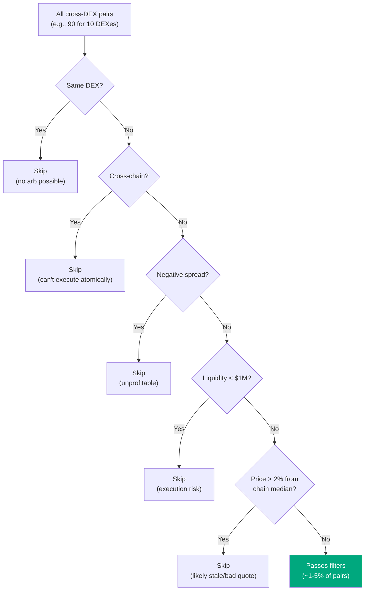

Filters are applied in order of cheapness — same-DEX and cross-chain checks
are free (string comparison), while liquidity and median require data lookups.

### Why $1M liquidity minimum?

A $3K trade in a $50K pool would move the price significantly (slippage).
$1M provides enough depth that a 1-3 WETH trade has negligible market impact.
This threshold eliminates most "fake" opportunities from illiquid pools.

### Why 2% median deviation?

If a DEX quotes WETH at $2,300 while 8 other DEXes on the same chain agree on
$2,350, the outlier is likely stale data from a lagging RPC node or a pool that
hasn't been traded recently. The 2% threshold catches these without rejecting
legitimate large spreads.

---

## Step 3: Price — Cost Model (`strategy.py`)

Every surviving pair goes through the **full cost waterfall** to calculate
actual net profit. All math uses `Decimal` (never `float`) to prevent precision
loss on financial calculations.

### Cost waterfall

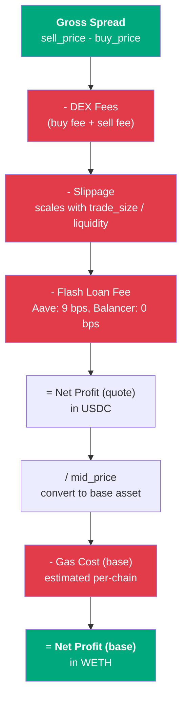

### Formulas

```
buy_cost      = trade_size × buy_price / (1 - fee_bps/10000)   [if fees not pre-included]
sell_proceeds = trade_size × sell_price × (1 - fee_bps/10000)   [if fees not pre-included]

slippage_cost = buy_cost × base_slippage × (1 + trade_size / liquidity)
flash_fee     = buy_cost × flash_loan_fee_bps / 10000

net_profit_quote = sell_proceeds - buy_cost - slippage_cost - flash_fee
net_profit_base  = (net_profit_quote / mid_price) - gas_cost_base
```

### Dynamic slippage

Slippage is **not** a fixed percentage — it scales with how much of the pool's
liquidity the trade consumes:

```
slippage = base_slippage × (1 + trade_size / pool_liquidity)
```

| Trade / Pool ratio | Effective slippage (at 15 bps base) |
|-------------------|--------------------------------------|
| $3K in $50M pool | ~15 bps (negligible extra) |
| $3K in $500K pool | ~16 bps (slight increase) |
| $3K in $50K pool | ~30 bps (significant — 2x base) |

### Key parameters

| Parameter | Typical value | Source |
|-----------|--------------|--------|
| `trade_size` | 1-3 WETH | Config |
| `fee_bps` | 30 (standard V3 pool) | Pool-specific |
| `slippage_bps` | 10-15 | Config |
| `flash_loan_fee_bps` | 9 (Aave V3), 0 (Balancer) | Config |
| `gas_cost_base` | ~0.003 ETH (Arbitrum), ~0.01 ETH (Ethereum) | Estimated at runtime |

---

## Step 4: Score & Rank (`scanner.py`)

Every opportunity that survives filtering and pricing gets a **composite score**
(0.0 - 1.0) for priority ranking.

### Scoring formula

```
score = 0.50 × profit_score      net_profit / 1.0 WETH, capped at 1.0
      + 0.25 × liquidity_score   log10(min_liq) / 7.0, capped at 1.0
      + 0.15 × flag_score        1.0 - (warning_count × 0.25), min 0
      + 0.10 × spread_score      spread_pct / 5.0, capped at 1.0
```

### Why these weights?

- **50% profit:** Profit is the objective function — it's what we're optimizing for
- **25% liquidity:** Guards against thin-pool false positives. A $10M pool with
  a 0.3% spread is far more reliable than a $50K pool with a 2% spread
- **15% safety flags:** Each warning flag (stale quote, low liquidity, thin market,
  high fee ratio) reduces this by 0.25. Four flags = zero. This is aggressive
  because multiple flags compound risk in ways a weighted average can't capture
- **10% spread:** Tie-breaker only. Wider spread = more room for execution
  slippage before the trade becomes unprofitable

### Warning flags

| Flag | Condition | Risk |
|------|-----------|------|
| `low_liquidity` | min liquidity < $100K | Slippage blow-up |
| `thin_market` | min volume < $50K/day | Low trading activity, stale prices |
| `stale_quote` | quote age > 60 seconds | Price may have moved since quote |
| `high_fee_ratio` | costs / gross_spread > 80% | Almost all profit eaten by costs |

### Liquidity score

Uses log-scale so the difference between $100K and $1M matters more than $10M
and $100M (both are "deep enough"):

```python
score = min(1.0, log10(min_liquidity_usd) / 7.0)
```

| Pool TVL | Score |
|----------|-------|
| $10M+ | 1.00 |
| $1M | 0.86 |
| $100K | 0.71 |
| $10K | 0.57 |

---

## Step 5: Priority Queue (`pipeline/queue.py`)

A **bounded, thread-safe priority queue** sits between the scanner (producer)
and the pipeline consumer. This decouples scan speed from pipeline processing
speed.

| Property | Value |
|----------|-------|
| Max size | 100 (configurable) |
| Priority | composite_score from scanner |
| Eviction | Lowest-priority candidate dropped when full |
| Extraction | Highest priority first |

### Back-pressure behavior

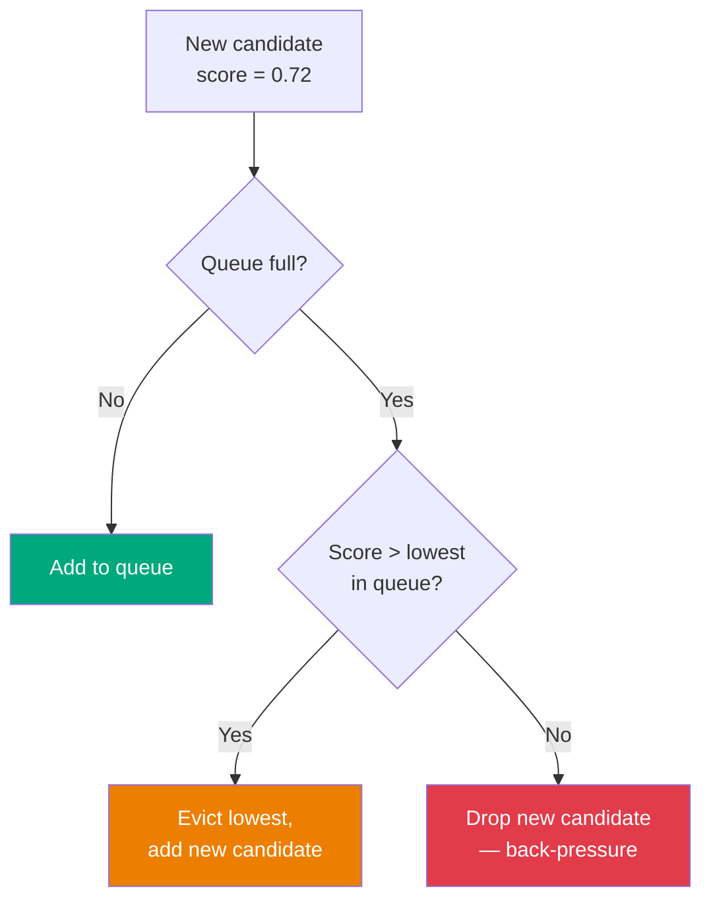

This ensures the pipeline always processes the **best available** opportunities,
even when the scanner produces faster than the pipeline can consume.

---

## Step 6: Risk Evaluation (`risk/policy.py`)

The pipeline consumer pops the highest-priority candidate and enters the
**6-stage pipeline**. After detection and pricing (stages 1-2), the opportunity
hits the risk policy — an **8-rule sequential gate** where any failure is a
hard veto.

### Risk evaluation flowchart

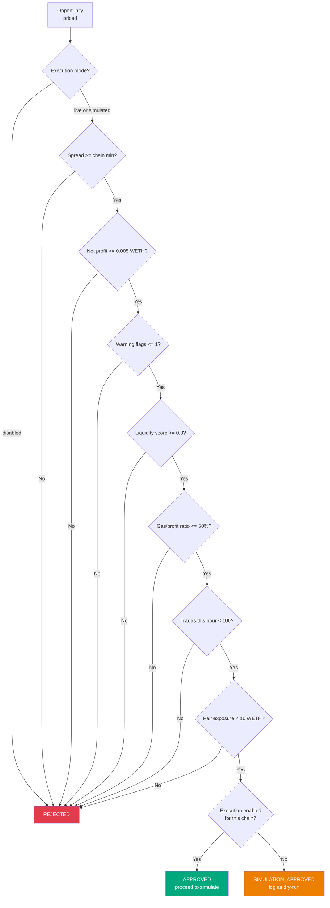

### Rules in detail

| # | Rule | Threshold | Why |
|---|------|-----------|-----|
| 1 | **Execution mode** | Per-chain: `live` / `simulated` / `disabled` | Prevents accidental trades on wrong chains |
| 2 | **Minimum spread** | Per-chain (see below) | Must exceed gas + fee floor |
| 3 | **Minimum net profit** | 0.005 WETH (~$12) | Below this, gas variance can flip trade negative |
| 4 | **Warning flags** | max 1 flag | Multiple flags = compounding risk |
| 5 | **Liquidity score** | min 0.3 | Pools below this risk slippage blow-up |
| 6 | **Gas-to-profit ratio** | max 50% | If gas eats >50% of profit, variance is too high |
| 7 | **Rate limiting** | max 100 trades/hour | Prevents execution clustering |
| 8 | **Exposure limit** | max 10 WETH per pair | Prevents concentration in one pair |

### Per-chain spread thresholds

Calibrated to each chain's gas cost — cheaper gas means tighter spreads are
still profitable:

| Chain | Min spread | Gas cost | Rationale |
|-------|-----------|----------|-----------|
| Ethereum | 0.40% | ~$2-5 | High gas needs bigger spread to cover |
| Arbitrum | 0.20% | ~$0.10 | Cheap gas, tighter spreads viable |
| Base | 0.15% | ~$0.05 | Very cheap gas |
| Optimism | 0.15% | ~$0.05 | Very cheap gas |
| Polygon | 0.20% | ~$0.01 | Cheap but less liquid |
| BSC | 0.20% | ~$0.10 | Moderate gas |
| Avalanche | 0.25% | ~$0.10 | Moderate gas, less DEX depth |

### Simulation-approved path

If all rules pass but execution is disabled for the chain, the verdict is
`simulation_approved` — the opportunity appears on the dashboard as "would have
executed". This is the primary strategy tuning tool: watch simulation-approved
trades, verify they would have been profitable, then enable execution with
confidence.

---

## Step 7: Circuit Breaker (`risk/circuit_breaker.py`)

Before execution, the pipeline checks the circuit breaker — an automatic safety
mechanism that **pauses all trades** when degraded conditions are detected.

### State machine

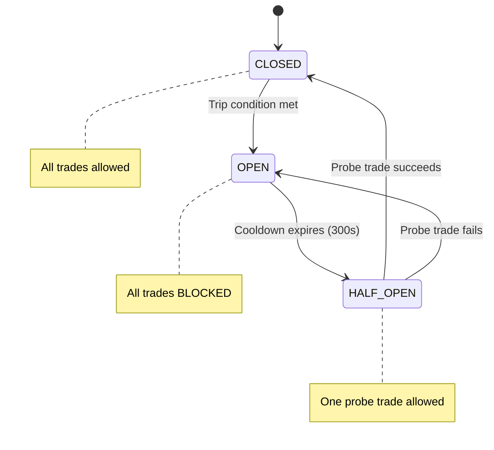

### Trip conditions

| Condition | Threshold | Window | What it detects |
|-----------|-----------|--------|-----------------|
| Repeated reverts | 3 reverts | 5 min | Contract bug, market conditions changed |
| RPC degradation | 5 errors | 60 sec | Node failing, quotes unreliable |
| Stale data | No fresh quote | 120 sec | Data pipeline broken |
| Block exposure | 3 trades | 10 blocks | Execution clustering risk |

### Recovery

After 300 seconds cooldown, the breaker enters `HALF_OPEN` and allows one
"probe" trade. If it succeeds, the breaker resets to `CLOSED`. If it fails
(revert), the breaker goes back to `OPEN` for another cooldown cycle.

---

## Step 8: Simulation (`chain_executor.py`)

Before spending real gas, the bot runs a **free dry-run** using `eth_call`.
This executes the full transaction against the current chain state without
broadcasting it. If it would revert, we skip execution.

### What simulation catches

- **Insufficient profit:** minProfit check in the contract
- **Bad routes:** wrong router address, unsupported token pair
- **Approval issues:** token not approved for router
- **Stale prices:** price moved since quote (most common rejection)

### Why simulate?

A failed L2 transaction costs ~$0.05-0.10 in gas. Simulation is free. Over
thousands of rejected simulations, this saves significant gas costs.

On Ethereum mainnet with Flashbots, failed bundles cost nothing (they just
don't get included). But simulation still helps: it prevents wasting Flashbots
relay capacity and block builder attention on bundles that would revert.

---

## Step 9: Execution (`chain_executor.py`)

If simulation passes, the bot builds, signs, and broadcasts the real
transaction.

### Execution workflow

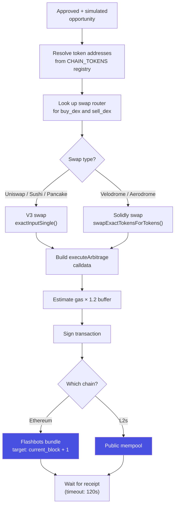

### Flash loan arbitrage sequence

This is what happens inside the smart contract in a single atomic transaction:

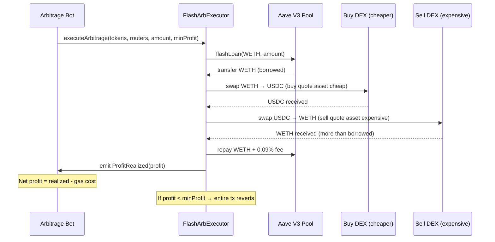

### Submission strategies

| Chain | Method | Why |
|-------|--------|-----|
| Ethereum | **Flashbots** (private relay) | MEV protection — tx not visible in mempool, no gas cost on failure |
| All L2s | Public mempool | No Flashbots equivalent; L2 gas is cheap enough that failed txs are acceptable |

### Gas estimation

```
estimate = eth_estimateGas(tx_data) × 1.2    (20% safety buffer)
fallback = 500,000 gas                        (if estimation fails)
```

**Why 1.2x:** Gas can vary ±10% between estimate and execution because other
transactions in the same block change storage slot costs (cold→warm SLOAD).
1.2x covers the worst case without overpaying. Typical flash arb: 300-400K gas.

### Swap types

| Type | ID | DEXes | Contract interface |
|------|----|-------|-------------------|
| V3 | 0 | Uniswap V3, Sushi V3, PancakeSwap V3 | `exactInputSingle()` |
| Velodrome | 1 | Velodrome V2, Aerodrome | `swapExactTokensForTokens()` |

---

## Step 10: Verification & PnL Reconciliation (`pipeline/verifier.py`)

After submission, the verifier checks the on-chain outcome and reconciles
expected vs. actual profit.

### Verification workflow

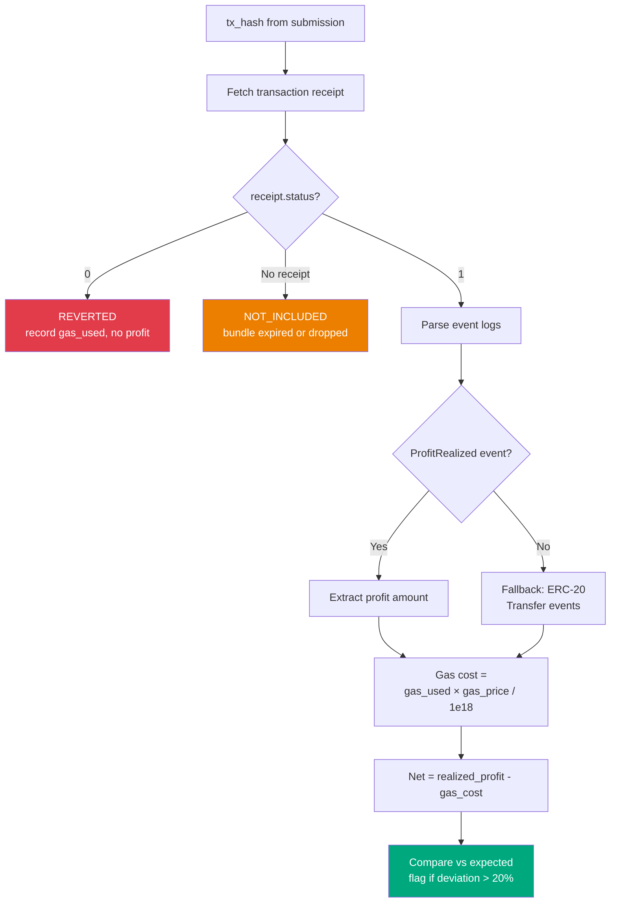

### Three outcomes

| Outcome | Meaning | Action |
|---------|---------|--------|
| **Included** | Tx mined, not reverted | Extract profit, record success |
| **Reverted** | Tx mined but reverted | Record gas loss, feed to circuit breaker |
| **Not included** | Bundle expired / dropped | No cost (Flashbots) or gas cost (L2) |

### PnL reconciliation

```
deviation     = actual_profit - expected_profit
deviation_pct = deviation / expected × 100
```

Deviations > 20% are flagged and logged. Consistent deviations in one direction
indicate the cost model needs recalibration (e.g., slippage estimate too low,
gas estimate off).

---

## Pipeline Lifecycle Summary (`pipeline/lifecycle.py`)

All 6 stages in one view:

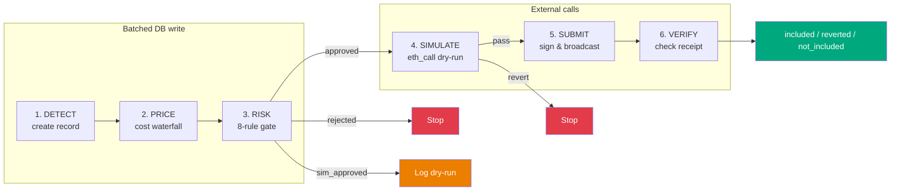

Stages 1-3 are batched into a single DB transaction (fewer round-trips, atomic).
Stages 4-6 involve external RPC calls and persist independently.

Every stage is timed in milliseconds. The per-stage breakdown is logged and
stored in `logs/latency.jsonl` for performance analysis.

---

## Supporting Reference

### Data Models (`models.py`)

**MarketQuote** — a single price observation from one DEX:
```
dex, pair, buy_price, sell_price, fee_bps, fee_included
volume_usd, liquidity_usd, quote_timestamp
```

**Opportunity** — a priced arbitrage candidate:
```
pair, buy_dex, sell_dex, chain, trade_size
cost_to_buy_quote, proceeds_from_sell_quote
gross_profit_quote, net_profit_quote, net_profit_base
dex_fee_cost_quote, flash_loan_fee_quote, slippage_cost_quote, gas_cost_base
warning_flags, liquidity_score, is_cross_chain
```

All financial fields are `Decimal`. Float-to-Decimal conversion goes through
`str()` to avoid IEEE-754 precision loss (e.g., `0.1` float → `0.1000000000000000055511151231257827021181583404541015625`).

### Configuration (`config.py`)

| Field | Example | Purpose |
|-------|---------|---------|
| `pair` | `"WETH/USDC"` | Primary trading pair |
| `trade_size` | `1.0` | Trade amount in base asset (WETH) |
| `min_profit_base` | `0.005` | Hard minimum profit (WETH) |
| `flash_loan_fee_bps` | `9` | Aave V3: 9, Balancer: 0 |
| `slippage_bps` | `15` | Base slippage estimate |
| `dexes` | list (2+ required) | DEX configs with chain + type |
| `chain_execution_mode` | `{"arbitrum": "live"}` | Per-chain mode |

### Supported Chains

| Chain | Gas | Min spread | Execution |
|-------|-----|------------|-----------|
| Ethereum | ~$2-5 | 0.40% | Flashbots |
| Arbitrum | ~$0.10 | 0.20% | Public mempool |
| Base | ~$0.05 | 0.15% | Public mempool |
| Optimism | ~$0.05 | 0.15% | Public mempool |
| Polygon | ~$0.01 | 0.20% | Public mempool |
| BSC | ~$0.10 | 0.20% | Public mempool |
| Avalanche | ~$0.10 | 0.25% | Public mempool |

### Database Schema

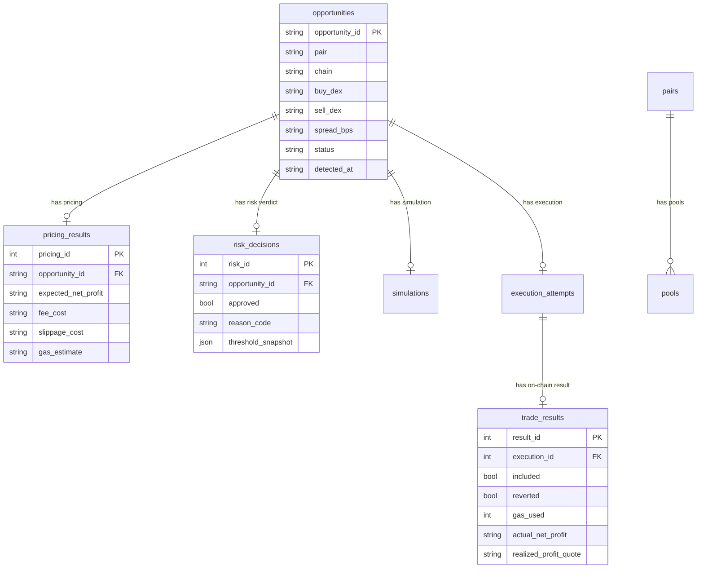
