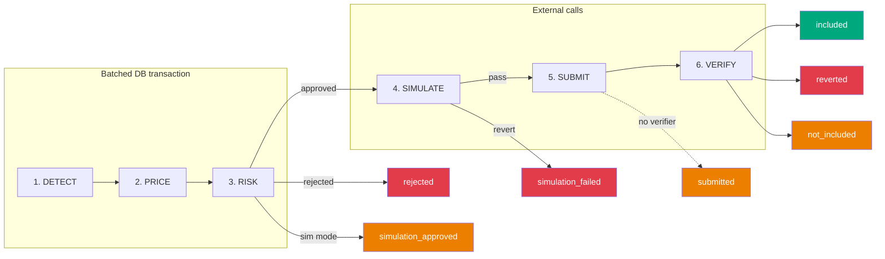
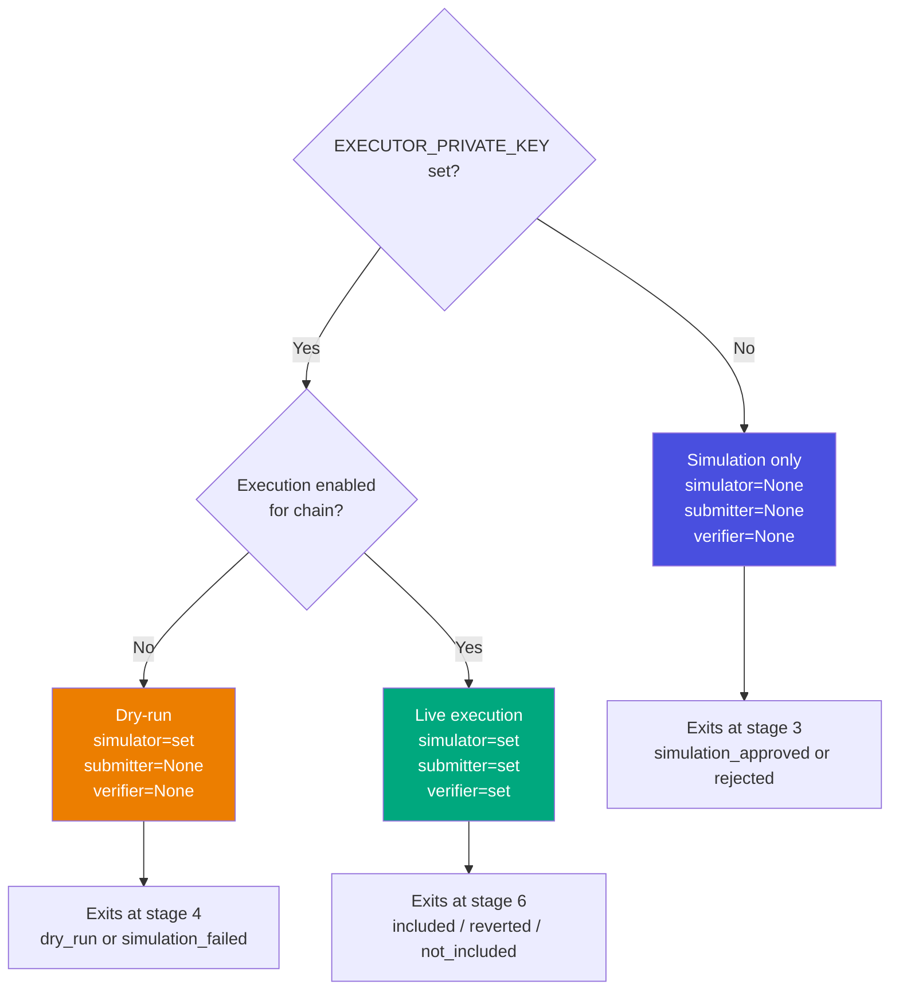
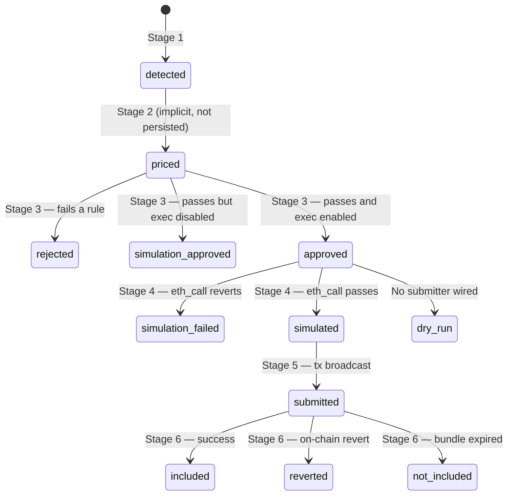

# Pipeline Lifecycle

> How an arbitrage opportunity flows from detection to on-chain execution,
> and why each stage exists.

## Overview

Every opportunity enters `CandidatePipeline.process()` and exits with one of
7 possible statuses. The pipeline is **fail-fast** — any stage failure stops
processing immediately.

---

## Stage 1: Detect

| | |
|---|---|
| **Always runs?** | Yes |
| **What it does** | Creates the opportunity record in the database |
| **Can stop pipeline?** | No — always succeeds |
| **Persists** | `opportunities` table: pair, chain, buy_dex, sell_dex, spread_bps |

This is the point of no return — once created, the opportunity is visible on
the dashboard regardless of whether it passes risk evaluation. The `opp_id`
returned here is the key that all subsequent stages reference.

**Typical latency:** <1ms

---

## Stage 2: Price

| | |
|---|---|
| **Always runs?** | Yes |
| **What it does** | Persists the full cost breakdown |
| **Can stop pipeline?** | No — the pricing math already happened in the strategy layer; this just saves it |
| **Persists** | `pricing_results` table: input_amount, estimated_output, fee_cost, slippage_cost, gas_estimate, expected_net_profit, liquidity |

Note: there is no intermediate "priced" status update. Stages 1-3 run inside
a single batched DB transaction, so "priced" is never visible to other readers.
This saves one DB round-trip (~3-4ms on Neon Postgres).

**Typical latency:** <1ms

---

## Stage 3: Risk

| | |
|---|---|
| **Always runs?** | Yes |
| **What it does** | Evaluates 8 sequential rules from `RiskPolicy` |
| **Can stop pipeline?** | **Yes** — rejects ~99% of opportunities |
| **Persists** | `risk_decisions` table: approved, reason_code, threshold_snapshot (full analysis JSON) |

### Three outcomes

| Outcome | Meaning | Pipeline continues? |
|---------|---------|-------------------|
| `rejected` | Fails a rule (spread too low, profit too small, etc.) | **No** — stops here |
| `simulation_approved` | Passes all rules but execution is disabled for this chain | **No** — logged as "would have traded" |
| `approved` | Passes all rules and execution is enabled | **Yes** — proceeds to stage 4 |

### Why persist the threshold_snapshot?

The `threshold_snapshot` JSON contains every value the risk policy evaluated:
net profit, spread, fees, slippage, gas cost, liquidity score, warning flags,
and the reason for rejection. This means an engineer can debug why a trade was
rejected weeks later without re-running the risk policy — just query the DB or
click into the opportunity on the dashboard.

**Typical latency:** 2-5ms (includes one DB query for rate limiting)

---

## Stage 4: Simulate

| | |
|---|---|
| **Always runs?** | Only if `simulator` is wired (live or dry-run mode) |
| **What it does** | Calls `eth_call` to dry-run the full flash loan transaction against current chain state |
| **Can stop pipeline?** | **Yes** — if simulation reverts |
| **Persists** | `simulations` table: success, revert_reason, expected_net_profit |
| **Alerts** | Sends alert on simulation failure |

### Why simulate?

`eth_call` is **free** (no gas spent). It executes the exact same code path as
a real transaction but doesn't persist state changes. Common revert reasons:

- **Price moved since quote** (most common — the spread closed before we could execute)
- **Insufficient profit** (contract's `minProfit` check fails)
- **Bad route** (wrong router address, unsupported token pair)
- **Token approval issues** (contract not approved to spend tokens)

Without simulation, every revert costs gas ($0.05 on L2, $5-50 on L1).
With a ~95% simulation rejection rate on stale prices, this saves significant gas.

### What if simulator is None?

The pipeline skips straight to stage 5 (if submitter is wired) or exits as
`dry_run` (if no submitter). This happens in simulation-only mode where no
`EXECUTOR_PRIVATE_KEY` is configured.

**Typical latency:** 30-100ms (one RPC call)

---

## Stage 5: Submit

| | |
|---|---|
| **Always runs?** | Only if `submitter` is wired (live execution mode) |
| **What it does** | Signs the transaction and broadcasts it |
| **Can stop pipeline?** | No — if we get here, we send it |
| **Persists** | `execution_attempts` table: tx_hash, bundle_id, target_block, submission_type |

### Submission strategy

| Chain | Method | Why |
|-------|--------|-----|
| Ethereum | Flashbots bundle (private relay) | MEV protection — tx is not visible in public mempool. If not included in target block, bundle expires harmlessly (no gas cost). |
| Arbitrum, Base, Optimism, others | Public mempool | No Flashbots equivalent. Gas is cheap ($0.05) so failed txs are acceptable. |

### What if submitter is None?

The pipeline exits as `dry_run` — the opportunity passed all risk checks and
simulation but there's no execution stack configured. This is the normal exit
path when `EXECUTOR_PRIVATE_KEY` is not set.

**Typical latency:** 50-200ms (sign + broadcast)

---

## Stage 6: Verify

| | |
|---|---|
| **Always runs?** | Only if `verifier` is wired (live execution mode) |
| **What it does** | Fetches the transaction receipt and determines the outcome |
| **Can stop pipeline?** | No — records the outcome whatever it is |
| **Persists** | `trade_results` table: included, reverted, gas_used, realized_profit_quote, gas_cost_base, actual_net_profit, block_number |
| **Alerts** | Sends alert on successful trade or revert |

### Three outcomes

| Outcome | What happened | Status |
|---------|--------------|--------|
| **included** | Tx mined, not reverted. Profit extracted from `ProfitRealized` event. | `included` |
| **reverted** | Tx mined but reverted (status=0). Gas lost. | `reverted` |
| **not_included** | No receipt found. Flashbots bundle expired or tx dropped from mempool. | `not_included` |

### PnL reconciliation

After extracting the realized profit, the verifier compares it to the expected
profit from stage 2. Deviations >20% are flagged and logged. Consistent
deviations in one direction indicate the cost model needs recalibration.

### What if verifier is None?

The pipeline exits as `submitted` — the tx was sent but the outcome is unknown.
You'd have to check the block explorer manually.

**Typical latency:** 2-12 seconds (waiting for block inclusion)

---

## Wiring Modes

The pipeline's behavior is determined by which adapters are wired at startup:

---

## Status State Machine

An opportunity's status progresses through the pipeline stages:

---

## Timing Profile

| Stage | Typical latency | What dominates |
|-------|----------------|----------------|
| 1. Detect | <1ms | DB insert |
| 2. Price | <1ms | DB insert |
| 3. Risk | 2-5ms | DB query (rate limit count) |
| 4. Simulate | 30-100ms | RPC eth_call |
| 5. Submit | 50-200ms | Sign + broadcast |
| 6. Verify | 2-12s | Block inclusion wait |
| **Total (stages 1-3)** | **<10ms** | — |
| **Total (stages 1-6)** | **3-13s** | Stage 6 dominates |

Timings are recorded per-opportunity in `PipelineResult.timings` and logged
to `logs/latency.jsonl` for performance analysis.

---

## Key Source References

| Component | File | Line |
|-----------|------|------|
| Pipeline entry | `src/pipeline/lifecycle.py` | `process()` |
| Stage 1-6 logic | `src/pipeline/lifecycle.py` | `_process_inner()` |
| Simulator adapter | `src/run_event_driven.py` | `ChainExecutorSimulator` |
| Submitter adapter | `src/run_event_driven.py` | `ChainExecutorSubmitter` |
| Verifier adapter | `src/run_event_driven.py` | `OpportunityAwareVerifier` |
| Risk policy | `src/risk/policy.py` | `RiskPolicy.evaluate()` |
| Pipeline consumer | `src/run_event_driven.py` | `PipelineConsumer._run()` |
