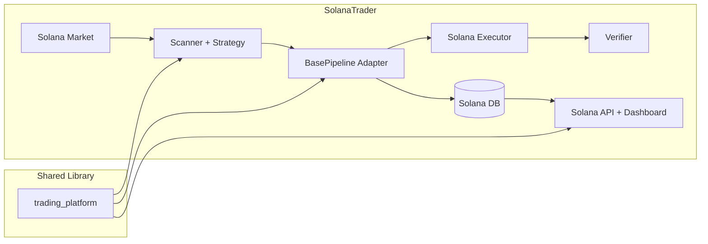

# SolanaTrader Full Plan

Last updated: 2026-04-16

## Executive Summary

We should build Solana support as a **new product repo** rather than extending
the current EVM bot in place.

Recommended structure:

- `/Users/tamir.wainstain/src/trading_platform`
  Shared platform library
- `ArbitrageTrader`
  Existing EVM/flash-loan arbitrage product
- `SolanaTrader`
  New Solana-specific arbitrage product

Recommended v1 operating model:

- **Separate Solana repo**
- **Separate Solana database**
- **Separate Solana dashboard/API**
- **Shared platform library**

This is the fastest and safest path because the current EVM bot is already live
and the existing persistence/dashboard code still assumes EVM execution concepts
such as `tx_hash`, `flashbots`, `gas_used`, Aave, routers, and ETH-denominated
cost displays.

## Why A New Repo

### Current state

`ArbitrageTrader` is not just "multichain". It is specifically an
**EVM arbitrage product**.

Examples:

- `src/execution/chain_executor.py`
  assumes `web3.py`, EVM RPC, router ABIs, Solidity executor contracts, and
  `eth_call` simulation
- `contracts/FlashArbExecutor.sol`
  is Solidity/Aave/flash-loan based
- `src/market/onchain_market.py`
  assumes EVM quote contracts and ERC-20 addresses
- `src/persistence/db.py`
  stores EVM-shaped execution fields like `tx_hash`, `bundle_id`,
  `target_block`, `gas_used`, `gas_cost_base`
- `src/api/app.py`
  exposes EVM wallet balance and router/Aave execution readiness
- dashboards label profit and cost values in `ETH`, use Etherscan-style tx
  links, and show flash-loan execution status

### What this means

Solana is not a small chain addition.

It differs in:

- account model
- transaction construction
- signing flow
- simulation flow
- DEX integration model
- fee model
- token metadata
- confirmation/finality handling

Trying to make Solana fit inside the EVM product now would create coupling,
slow delivery, and increase production risk for the already-live EVM bot.

## Why Separate DB And Dashboard For V1

### Separate DB

Recommended for v1: **yes**.

Reason:

The current schema is useful, but still shaped around EVM execution semantics.
If we force Solana into the same DB now, we will either:

- add many nullable fields and overloaded meanings, or
- break existing EVM analytics assumptions

That will create more migration and reporting work than simply giving
`SolanaTrader` its own clean schema.

### Separate dashboard

Recommended for v1: **yes**.

Reason:

The current dashboard and analytics are strong, but they are operationally
focused on EVM:

- ETH-denominated gas/profit labels
- Flashbots/public-mempool submission model
- Aave/router readiness checks
- Etherscan tx links
- flash-loan and gas-centric detail views

It is better to create a Solana dashboard that reflects Solana realities
instead of bending every screen into cross-product compromise.

### Future convergence

Later, once both products are stable, we can add:

- shared executive summary dashboards
- cross-product analytics
- common reporting exports

But we should not force a shared DB/dashboard before the Solana product itself
is proven.

## What Should Be Shared

The correct shared layer is:

`/Users/tamir.wainstain/src/trading_platform`

This repo already contains the right kind of shared abstractions:

- `src/pipeline/base_pipeline.py`
- `src/contracts.py`
- `src/risk/base_policy.py`
- `src/pipeline/queue.py`
- `src/alerting/*`
- `src/observability/*`
- `src/config/*`

These are exactly the kinds of pieces SolanaTrader should reuse.

### Shared responsibilities

`trading_platform` should own:

- pipeline orchestration
- platform-neutral submission and verification contracts
- rule engine framework
- queueing
- retries
- alert dispatching
- metrics and latency tracking
- shared config utilities

### Product-specific responsibilities

`ArbitrageTrader` should keep:

- EVM quote sources
- ERC-20 registries
- flash-loan execution
- EVM-specific readiness checks
- EVM dashboard and analytics

`SolanaTrader` should own:

- Solana market integrations
- Solana token/pool metadata
- Solana execution path
- Solana confirmation/verification logic
- Solana-specific readiness checks
- Solana dashboard and analytics

## Proposed Repository Structure

```text
/Users/tamir.wainstain/src/
├── trading_platform/
├── ArbitrageTrader/
└── SolanaTrader/
```

### Proposed `SolanaTrader` layout

```text
SolanaTrader/
├── pyproject.toml
├── README.md
├── config/
│   ├── local_scan.json
│   ├── prod_scan.json
│   ├── prod_execute.json
│   └── venues.json
├── docs/
│   ├── architecture.md
│   ├── go_live_checklist.md
│   ├── execution_status.md
│   └── dashboard_notes.md
├── scripts/
│   ├── run_local.sh
│   ├── check_readiness.py
│   ├── rehearsal.py
│   ├── migrate_db.py
│   └── test_rpc_endpoints.py
├── src/
│   ├── main.py
│   ├── run_event_driven.py
│   ├── api/
│   │   └── app.py
│   ├── dashboards/
│   │   ├── main_dashboard.py
│   │   ├── analytics_dashboard.py
│   │   ├── ops_dashboard.py
│   │   └── opportunity_detail.py
│   ├── core/
│   │   ├── config.py
│   │   ├── models.py
│   │   ├── tokens.py
│   │   ├── pools.py
│   │   └── venues.py
│   ├── market/
│   │   ├── solana_market.py
│   │   ├── quote_normalizer.py
│   │   └── liquidity_estimator.py
│   ├── strategy/
│   │   ├── scanner.py
│   │   └── arb_strategy.py
│   ├── execution/
│   │   ├── solana_executor.py
│   │   ├── submitter.py
│   │   ├── simulator.py
│   │   └── verifier.py
│   ├── persistence/
│   │   ├── db.py
│   │   └── repository.py
│   ├── observability/
│   │   ├── wallet.py
│   │   └── quote_diagnostics.py
│   └── registry/
│       ├── discovery.py
│       ├── monitored_pools.py
│       └── pair_refresher.py
└── tests/
```

## Proposed Architecture

### High-level model



### Core principle

`trading_platform` orchestrates.

`SolanaTrader` implements the product-specific adapters:

- detect candidates
- price candidates
- evaluate risk rules
- simulate
- submit
- verify
- persist product-specific details

## Recommended Development Phases

## Phase 0: Foundation And Decisions

Goal:

- make SolanaTrader a first-class new product, not an experiment branch

Work:

- create `SolanaTrader` repo
- depend on local `/Users/tamir.wainstain/src/trading_platform`
- write architecture doc and v1 scope
- choose initial Solana venues and initial 1-2 pairs
- define production success criteria

Decisions to lock:

- initial venues
- initial pairs
- initial execution mode for v1
- DB backend choice for Solana prod
- deployment model for Solana API/dashboard

Exit criteria:

- repo skeleton exists
- shared dependency is wired
- scope is frozen for phase 1

## Phase 1: Scanner-Only Solana Product

Goal:

- detect and store Solana opportunities with no execution risk

Work:

- implement Solana config models
- implement token registry
- implement venue registry
- implement Solana quote collection
- normalize quotes into product models
- adapt scanner and strategy
- persist opportunities, pricing, and risk decisions
- expose initial dashboard/API

Important rule:

- **No live execution in phase 1**

Exit criteria:

- Solana quotes are being collected
- opportunities are visible in DB
- dashboard shows live scan activity
- risk rejections look sane

## Phase 2: Solana Risk Calibration

Goal:

- make detected opportunities operationally meaningful

Work:

- calibrate transaction fee model
- calibrate slippage assumptions
- calibrate minimum liquidity thresholds
- calibrate spread thresholds
- add outlier filtering tuned for Solana venues
- add near-miss analytics

Exit criteria:

- opportunity quality is stable enough for rehearsal
- false positives are manageable
- analytics explain rejections clearly

## Phase 3: Solana Execution Backend

Goal:

- support full pipeline simulation -> submit -> verify

Work:

- implement `solana_executor.py`
- implement transaction simulation adapter
- implement submitter returning `SubmissionRef`
- implement verifier returning `VerificationOutcome`
- persist execution attempts and results
- wire execution stack into `run_event_driven.py`

Important design note:

- This should use the `trading_platform` submission/verifier contracts
- It should **not** try to imitate the EVM executor internals

Exit criteria:

- local dry-run and replay flow works end-to-end
- verification records are stored and queryable

## Phase 4: Rehearsal And Operational Hardening

Goal:

- prove the Solana stack behaves well before real rollout

Work:

- implement readiness checker
- implement rehearsal script
- add wallet balance endpoint
- add venue health and RPC health diagnostics
- add execution kill switch and pause control
- run prolonged simulation mode in prod-like conditions

Exit criteria:

- readiness passes cleanly
- rehearsal succeeds reliably
- ops dashboard shows actionable health signals

## Phase 5: Narrow Live Rollout

Goal:

- go live with minimum blast radius

Work:

- enable one pair only
- enable one or two venues only
- cap size aggressively
- enable fast rollback controls
- review every live attempt manually at first

Exit criteria:

- first real trade verified
- observed spread capture is acceptable
- revert/failure rate is within limits

## Phase 6: Scale And Optimization

Goal:

- expand only after evidence

Work:

- add more pairs
- add more venues
- tune thresholds
- tune scheduling and polling
- add richer PnL analytics

Exit criteria:

- system is stable under broader venue/pair set

## Solana DB Strategy

Recommendation:

- **Separate DB for Solana v1**

### Why

This gives us:

- clean schema design
- no risky migrations against the live EVM bot
- freedom to model Solana-specific execution metadata
- simpler dashboards and analytics

### Suggested v1 schema direction

Core tables should mirror the lifecycle shape because that part is good:

- `opportunities`
- `pricing_results`
- `risk_decisions`
- `simulations`
- `execution_attempts`
- `trade_results`
- `scan_history`
- `quote_diagnostics`
- `system_checkpoints`

But the execution/result fields should be renamed to be product-neutral.

### Suggested execution schema principles

Prefer generic fields:

- `submission_ref`
- `submission_kind`
- `submitted_at`
- `execution_status`
- `confirmation_slot`
- `finality_status`
- `fee_paid_native`
- `realized_profit_quote`
- `realized_profit_native`
- `actual_net_profit_native`

Avoid hard-coding EVM-only concepts as primary fields:

- `bundle_id`
- `target_block`
- `flashbots`
- `gas_used` as the main economics concept

If some Solana execution metadata is highly venue- or runtime-specific, store it
in JSON metadata columns rather than forcing everything into rigid top-level
columns too early.

## Solana Dashboard Strategy

Recommendation:

- **Separate Solana dashboard for v1**

### Why

We want the Solana UI to show Solana-native operations, not awkward EVM labels.

The Solana dashboard should have:

- venue health
- RPC/node health
- wallet balances
- opportunity funnel
- simulation pass/fail
- execution attempts
- realized PnL
- fee spend in native units
- venue route performance

### Suggested pages

#### Main dashboard

- scanner status
- execution status
- wallet balance
- recent opportunities
- recent executions
- per-venue status cards

#### Analytics

- PnL over time
- profit by pair
- profit by route
- expected vs realized
- fee efficiency
- rejection reasons
- near misses

#### Ops

- readiness state
- RPC health
- quote success rate
- simulator success rate
- wallet funding
- pause / go-live controls

## What To Reuse From ArbitrageTrader

### Reuse conceptually

- lifecycle stages
- risk gates
- scan history idea
- opportunity detail workflow
- readiness/rehearsal/go-live process
- dashboard information architecture

### Reuse via `trading_platform`

- `BasePipeline`
- `SubmissionRef`
- `VerificationOutcome`
- `RiskVerdict`
- rule engine
- queue
- alerting
- observability helpers

### Do not reuse directly

- `src/execution/chain_executor.py`
- `contracts/FlashArbExecutor.sol`
- ERC-20 token registry files
- EVM wallet balance endpoint
- EVM execution analytics as-is

## Suggested V1 Technical Milestones

### Milestone A: Repo bootstrap

Deliverables:

- new `SolanaTrader` repo
- `pyproject.toml`
- shared dependency on `trading_platform`
- minimal app skeleton

### Milestone B: scanner-only

Deliverables:

- Solana quote ingestion
- opportunity detection
- DB persistence
- dashboard/API read path

### Milestone C: calibrated analytics

Deliverables:

- rejection analysis
- near misses
- reliable fee/slippage accounting

### Milestone D: execution rehearsal

Deliverables:

- simulation
- submission
- verification
- readiness and rehearsal scripts

### Milestone E: narrow live launch

Deliverables:

- one pair live
- one or two venues
- small size
- manual review loop

## Team / Implementation Guidance

### Keep the EVM bot stable

Do not refactor `ArbitrageTrader` deeply while bringing up SolanaTrader unless
the change clearly belongs in `trading_platform`.

### Use platform seams, not cross-repo copy/paste

If a feature is truly shared:

- put it in `trading_platform`

If it is Solana-specific:

- keep it in `SolanaTrader`

### Optimize for shipping scanner-first

The best first proof is:

- clean Solana opportunity ingestion
- realistic filtering
- useful analytics

Execution should come after data quality is trusted.

## Risks

### Risk 1: over-sharing too early

If we try to force DB/dashboard sharing now, we will delay delivery and make the
live EVM system harder to reason about.

Mitigation:

- separate Solana product surfaces for v1

### Risk 2: accidental platform pollution

If Solana-specific concepts get pushed into `trading_platform`, the shared
library will stop being truly shared.

Mitigation:

- keep `trading_platform` protocol-first and product-neutral

### Risk 3: scanner quality looks good but execution reality differs

Mitigation:

- rehearsal phase
- conservative sizing
- narrow go-live

## Final Recommendation

Build:

- a **new `SolanaTrader` repo**
- with a **separate Solana DB**
- and a **separate Solana dashboard/API**
- while reusing `/Users/tamir.wainstain/src/trading_platform` as the shared
  library

This is the cleanest architecture, the lowest-risk path for the live EVM bot,
and the fastest route to a real Solana product.

## Immediate Next Steps

1. Create the `SolanaTrader` repo skeleton.
2. Define the Solana v1 venues and pairs.
3. Add `trading_platform` as a dependency.
4. Implement scanner-only ingestion first.
5. Design the Solana v1 DB schema before any execution code.
